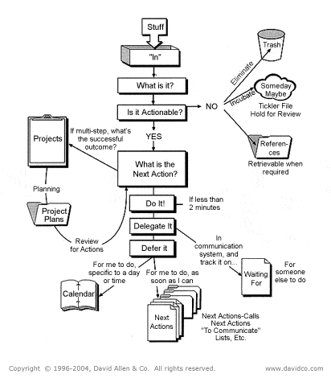
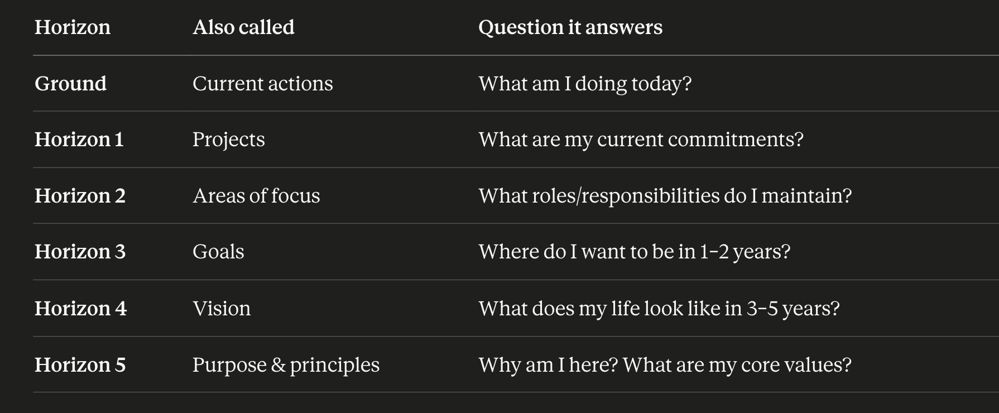

The workflow diagram is the best place to start. Just keep in mind that it's just the mechanical "this is how you handle tasks" part of GTD.

Once you get comfortable at being able to take anything that comes your way (email, snail mail, meeting action items, scheduling events, household stuff, ... anything!) and appropriately file it away into your system (or just do it!), then you are ready for the rest of what GTD is.

The next best thing to then learn is Areas of Focus/Responsibility, IMO. These are the areas in your life you need to maintain. These are not in the flow chart but they become important to start building yourself up as a full GTDer. The first thing you should do is look at all of your projects (active and even someday/maybe projects) and figure out what area they belong to. What aspect of your life does this project help maintain? It is my opinion that a lot of GTDers only use "Home" and "Work" areas. That's fine, I guess, but I think that for most active lives, it's really not enough. For me, I get a little more fine-grained (but not TOO fine-grained!). I split up "Home" into "Family", "Marriage", "House", and "Finances". I then add personal areas like "Health" or "Spirituality". These are all areas of my life important enough that I will be maintaining them. Here's a blog post I found helpful and what inspired me to think deeper about my own areas of focus: https://facedragons.com/productivity/areas-of-focus-examples/

Once you've really wrapped your head around GTD's Areas of Focus it's time to finally get into Horizons of Focus. This is where you take a serious look at your life, as a human being who will only live for a finite amount of time. What will you decide to do with your life? And how will what you're doing now get you there? Are you doing what's truly important to you? Or is a lot of your time spent on things that aren't meaningful? This part of GTD is very introspective and can be emotional. If thoughts like these are difficult for you, I recommend a licensed counselor They do not need to understand GTD, they just need to help you emotionally navigate you through the big picture stuff in your life. Ultimately, you will need to make the connections in your GTD system from the very top level to the very bottom level. Here's a 7 minute video where David Allen breaks this down probably the best: https://www.youtube.com/watch?v=jQRhHyb1BAw

The final part of GTD is making it personal. That is, working through your own personal struggles of getting things done, like procrastination. Procrastination is a symptom, not a cause. You will need to figure out yourself and do the hard part of working through whatever the underlying issue is for you, personally, on why you do some things and not others. Or figuring out what tools you like and don't like. Paper or digital or both? Or figuring out your natural energy rhythm throughout the day or week or year. When should you do what kinds of things? What's best for you? And, don't forget, figure out how to truly LIVE life and make it interesting and fun for YOU! Don't become a slave to your own system!

Je vais cramer ta mere on va voir si c'est esthetique

